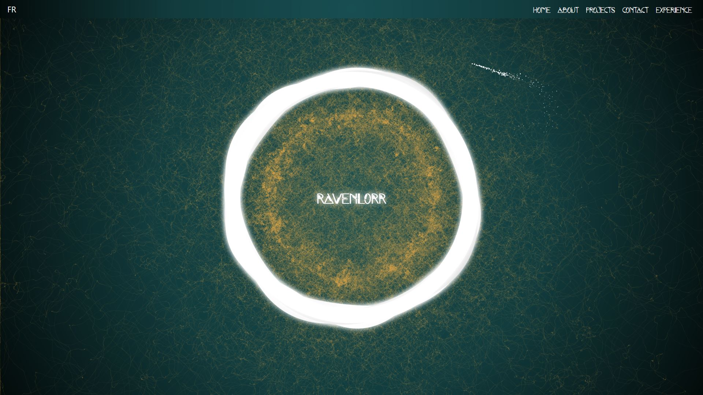

# 🌟 Portfolio Project

This portfolio project, built using modern web technologies including React, Node.js, Tailwind CSS, and various other npm packages listed below, showcases my various skills and knowledge as a developer. Enjoy



## ✨ Features

- **🏠 Home Page**: The landing page with beautiful particles animation.
- **👤 About Page**: Provides information about me.
- **💼 Projects Page**: Showcases various projects I've completed.
- **📞 Contact Page**: Allows visitors to get in touch with me.
- **📊 Experience Page**: Details my professional experience.
- **🔗 NavBar**: A responsive navigation bar.
- **🌍 Translation**: Supports multiple languages (English and French).

## 🛠️ Built Details

<p align="center">
  
  
  
  
  
</p>

- **⚛️ React**: ^18.3.1
- **🌐 Node.js**: >=18.0.0
- **📦 npm**: >=8.0.0
- **🎨 tailwindcss**: ^3.4.13
- **🛡️ eslint**: ^9.13.0
- **🚀 vitejs**: ^5.4.10
- **🧼 dompurify**: ^3.1.7
- **🎞️ framer-motion**: ^11.11.9
- **🔒 react-google-recaptcha**: ^3.1.0

*All others are listed in package.json at the root of the project.*

## ⚙️ Installation

1. **📂 Clone the repository**:
    ```sh
    git clone https://github.com/RavenLorr/portfolio.git
    cd portfolio
    ```

2. **📥 Install dependencies**:
    ```sh
    npm install
    ```

## 🚀 Usage

- **👨‍💻 Start the development server**:
    ```sh
    npm run dev
    ```

- **🔨 Build the project**:
    ```sh
    npm run build
    ```

- **👀 Preview the build**:
    ```sh
    npm run preview
    ```

- **📏 Lint the code**:
    ```sh
    npm run lint
    ```

- **🛠️ Fix linting issues**:
    ```sh
    npm run lint:fix
    ```

- **🧹 Format the code**:
    ```sh
    npm run format
    ```
- **🎨 Build Tailwind CSS with watcher**:
    ```sh
    npx tailwindcss -i ./src/index.css -o ./src/style.css --watch
    ```

## 🤝 Contributing

Contributions are welcome! Please open an issue or submit a pull request for any changes.

## 📜 License

This portfolio is licensed under a Creative Commons [Attribution-NonCommercial-NoDerivatives 4.0 International License](https://creativecommons.org/licenses/by-nc-nd/4.0/deed.en).

You are welcome to view, share, and take inspiration from my work. However, please do not copy, modify, or distribute it without my permission. If you create something inspired by this portfolio, I’d appreciate a shout-out! 🙏

## 🙏 Acknowledgements

Thanks to all the developers and their open-source projects that inspired me.
*Note that all the codes have been modified and adapted to React/Tailwind and my needs and might be improved or completely replaced in the future.*
- Clint Brown [TimeLine](https://codepen.io/clintabrown/pen/DQmPbp)
- Jeremie Boulay [Particle Trails](https://codepen.io/Jeremboo/pen/ENVaMY)
- Ryan Mulligan [pointer-particles](https://codepen.io/hexagoncircle/pen/vYwKNzR)

## ⭐ Star the Project

If you like this project, please give it a star! 🌟

---

<div align="center">
If I forgot anything or else, feel free to contact me. 📬
</div>
